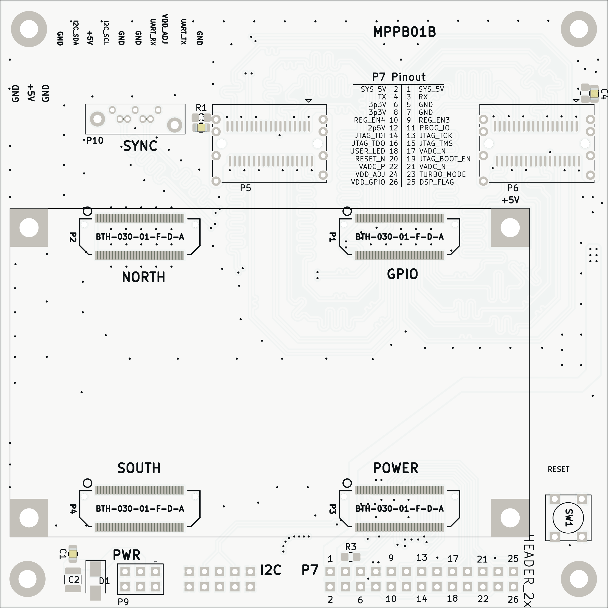
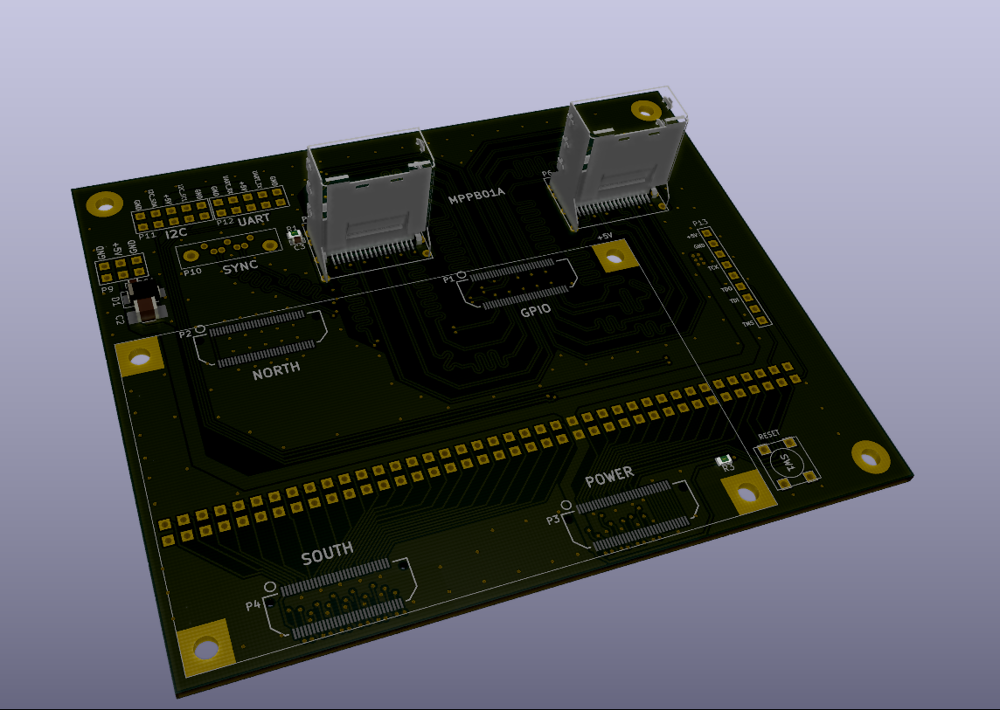

# MPPB01A -  Mechanical Parallella peripheral board

Elecromechanical interface to [Parallella board](https://parallella.org/). The module is especially useful for connection of [multi-channel](https://github.com/mlab-modules/ADCoctoSPI01) or [high-speed ADCs](https://www.mlab.cz/module/ADCdual01A). 

## Parameters

| Parameter | Value | Description |
|-----------|-------|-------------|
| LVDS connector | 2x miniSAS |  |
| Service interface | Pin-header |  |
| Operating and storage temperature | -20 - +40°C |  |
| Operational input voltage | 4.9 - 5.2V |  |
| I²C interface levels | 5V |  |
| UART interface levels | 3.3V |  |

## Usage examples 

Lightning mapping devices
  * [VLF Radio Storm Monitoring Station ](https://github.com/UniversalScientificTechnologies/RSMS02)
  * [UHF Radio Storm Monitoring Station ](https://github.com/UniversalScientificTechnologies/RSMS01)

